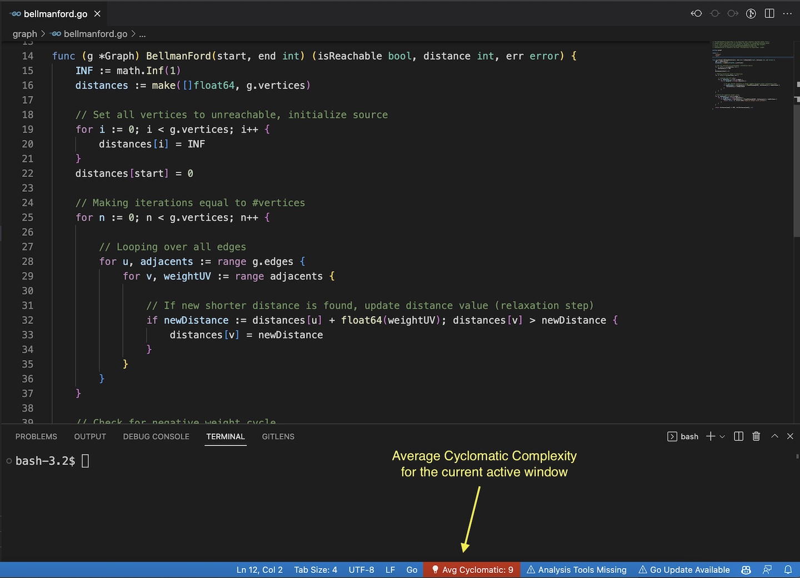
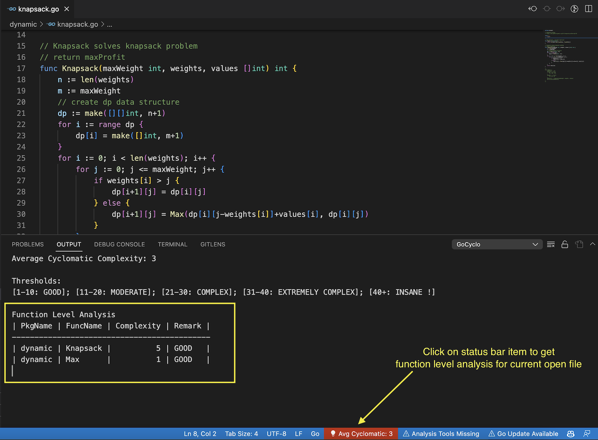
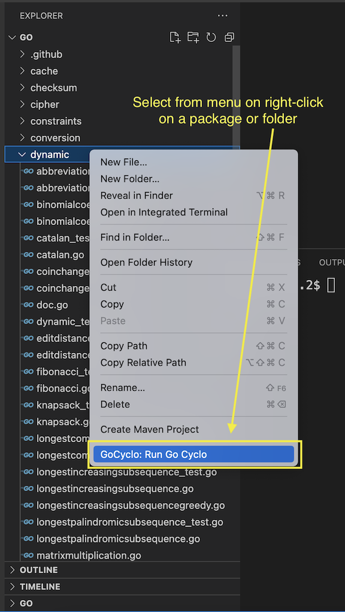
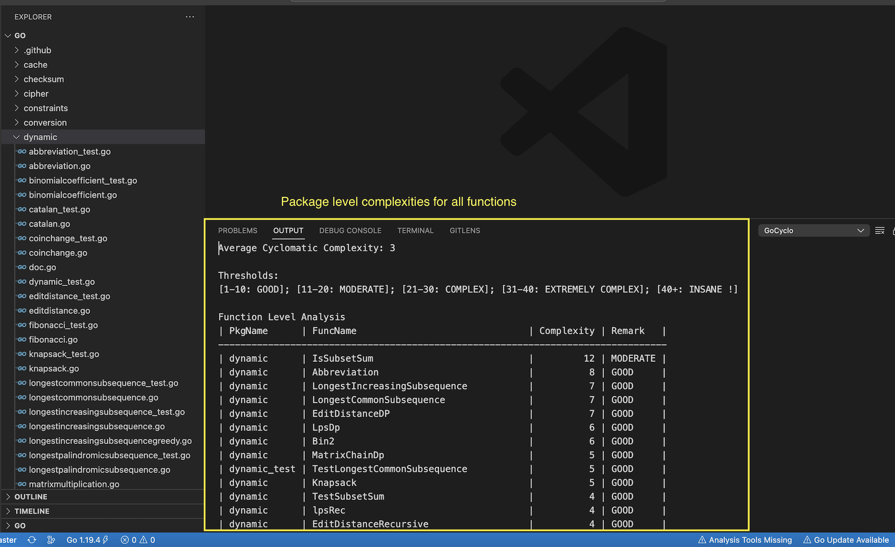

# vs-gocyclo README

This extension provides cyclomatic complexity for a go lang file.

### Limitations
- Currently works only on Mac & Linux.

### Prerequisites
- go lang version > 1.16 installed

## Features

### Shows the average cyclomatic complexity of a go file.

---

### Get analysis of all functions in a file
#### A)

#### B)

---

### Get package level analysis on right-clicking folder
#### Right click the package/folder

#### Total complexity shown in output channel

---

## Commands Available
1. `GoCyclo: Run Go Cyclo` - Activates/Reloads the extenstion.
2. `GoCyclo: Toggle Show/Hide Complexity Bar` - Show/Hide status bar item.
3. `GoCyclo: Get Total Complexity` - Shows file level analysis for open file

## Known Issues

1. Average complexity rendering is one key stroke lagging.

## Release Notes

### 1.0.0

* Initial release for the Plugin, only average complexity of the file is shown.

### 1.0.1

* Show total Complexity for the current file at function level when the status bar item at the bottom is clicked.
* New Command "GoCyclo: Get Total Complexity" to generate the function level complexity.

---

## Following extension guidelines

Ensure that you've read through the extensions guidelines and follow the best practices for creating your extension.

* [Extension Guidelines](https://code.visualstudio.com/api/references/extension-guidelines)

## For more information

* [Visual Studio Code's Markdown Support](http://code.visualstudio.com/docs/languages/markdown)
* [Markdown Syntax Reference](https://help.github.com/articles/markdown-basics/)

**Enjoy!**
